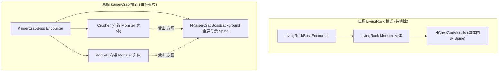

# Domain Model & Context: STS2_Things (Boss Architecture)

## 1. Ubiquitous Language (统一领域词汇表)

| 领域术语 | 英文标识 | 含义与系统定位 |
| :--- | :--- | :--- |
| **山神 / 洞穴神灵** | `CaveGod` | 本次核心搭载的万吨泰坦骨骼动画资产（28组动作、35张原版贴图、Spine 4.2.43 / 3.8.75 双兼容骨骼）。 |
| **活体巨岩** | `LivingRock` | 模组内旧版探索性单体 Boss 实现，与旧版贴图解绑，当前准备彻底废弃并全面清除。 |
| **帝王蟹** | `KaiserCrab` | 杀戮尖塔2（STS2）原版 Act 2 官方双钳巨怪 Boss（`KaiserCrabBoss`），其采用全屏背景 Spine 驱动与双爪独立实体架构。 |
| **背景多轨骨骼宿主** | `BossBackground` / `NCaveGodBackground` | 继承 Godot `Node2D`，挂载全屏主 Spine 节点，负责驱动多轨并发骨骼动作（左右臂、身躯、受击反馈、抓取事件）。 |
| **战斗遭遇模型** | `EncounterModel` | 游戏底层遭遇规则定义，包含怪兽生成列表、镜头缩放比（`CameraScaling`）、镜头偏移、槽位（`Slots`）及专用背景。 |
| **实体怪兽映射** | `MonsterModel` | 场上受击与意图判定单元。可对应单一 Boss 躯干，亦可参考帝王蟹拆分为左手（Left Fist）与右手（Right Fist）双怪兽单元。 |

---

## 2. 核心架构模式对比（KaiserCrab vs LivingRock）

