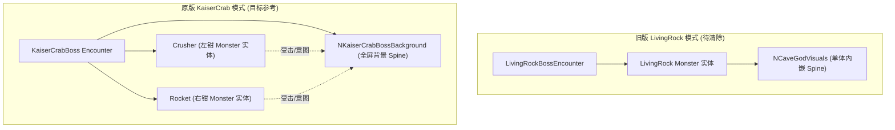

# Domain Model & Context: STS2_Things (Boss Architecture)

## 1. Ubiquitous Language (统一领域词汇表)

| 领域术语 | 英文标识 | 含义与系统定位 |
| :--- | :--- | :--- |
| **活体巨岩**（Living Megalith） | `CaveGod` | 显示名统一为「活体巨岩」；代码类名、ModelId、配置键与资源路径仍沿用 `CaveGod`。本次核心搭载的万吨泰坦骨骼动画资产（28组动作、35张原版贴图、Spine 4.2.43 / 3.8.75 双兼容骨骼）。 |
| ~~旧活体巨岩~~ | `LivingRock` | 已清除的旧版探索性单体 Boss；其显示名现由 `CaveGod` 继承，勿与之混淆。 |
| **帝王蟹** | `KaiserCrab` | 杀戮尖塔2（STS2）原版 Act 2 官方双钳巨怪 Boss（`KaiserCrabBoss`），其采用全屏背景 Spine 驱动与双爪独立实体架构。 |
| **背景多轨骨骼宿主** | `BossBackground` / `NCaveGodBackground` | 继承 Godot `Node2D`，挂载全屏主 Spine 节点，负责驱动多轨并发骨骼动作（左右臂、身躯、受击反馈、抓取事件）。 |
| **战斗遭遇模型** | `EncounterModel` | 游戏底层遭遇规则定义，包含怪兽生成列表、镜头缩放比（`CameraScaling`）、镜头偏移、槽位（`Slots`）及专用背景。 |
| **实体怪兽映射** | `MonsterModel` | 场上受击与意图判定单元。可对应单一 Boss 躯干，亦可参考帝王蟹拆分为左手（Left Fist）与右手（Right Fist）双怪兽单元。 |

---

## 2. 核心架构模式对比（KaiserCrab vs LivingRock）

```mermaid
graph TD
    subgraph "旧版 LivingRock 模式 (待清除)"
        LR_E["LivingRockBossEncounter"] --> LR_M["LivingRock Monster 实体"]
        LR_M --> LR_V["NCaveGodVisuals (单体内嵌 Spine)"]
    end

    subgraph "原版 KaiserCrab 模式 (目标参考)"
        KC_E["KaiserCrabBoss Encounter"] --> KC_BG["NKaiserCrabBossBackground (全屏背景 Spine)"]
        KC_E --> M1["Crusher (左钳 Monster 实体)"]
        KC_E --> M2["Rocket (右钳 Monster 实体)"]
        M1 -.->|受击/意图| KC_BG
        M2 -.->|受击/意图| KC_BG
    end
```

## 活体巨岩

**核心**：活体巨岩躯干的生命目标（左右臂显示为「巨岩左臂」「巨岩右臂」）。一阶段核心被击败后进入二阶段，二阶段核心被击败后结束遭遇。

**手臂**：左右两条可被击倒、随后恢复的战斗部件。击倒普通状态的任一手臂会暴露核心。

**核心暴露期**：断臂后，玩家可以攻击核心的三个行动窗口。它不是原版降低攻击伤害的“虚弱”负面效果。

**石爪**：抓握玩家时生成的临时生命目标。击碎石爪会解除试炼并取消重摔，不等同于打空手臂本身的生命。

**试炼**：被抓玩家选择的临时牌型限制，分为只可打出攻击牌与只可打出技能牌。

**成长**：晶簇崩发结算后、或从核心暴露期正常苏醒后获得的永久力量，持续到遭遇结束，保留至二阶段。

**晶脉**：核心持有的倒计时资源。每完成一个循环招式 +1，满 4 层时下一招替换为晶簇崩发；击倒手臂 -2，转阶段清零。核心埋在岩浆中时能力栏不可见，因此由双臂镜像显示。

**晶簇崩发**：晶脉满时插入的招式：攻击全体玩家、向每名玩家弃牌堆加入 2 张碎晶，然后成长。之后回到被插队的循环位置。

**碎晶**：1 费、消耗的状态牌；回合结束时仍在手牌中则受到 2 点伤害。

**崩落裂痕**：核心暴露时出现，层数为仍需造成的伤害（核心最大生命 25%，向上取整）。归零即裂痕贯通：本次苏醒不成长并清空晶脉。
