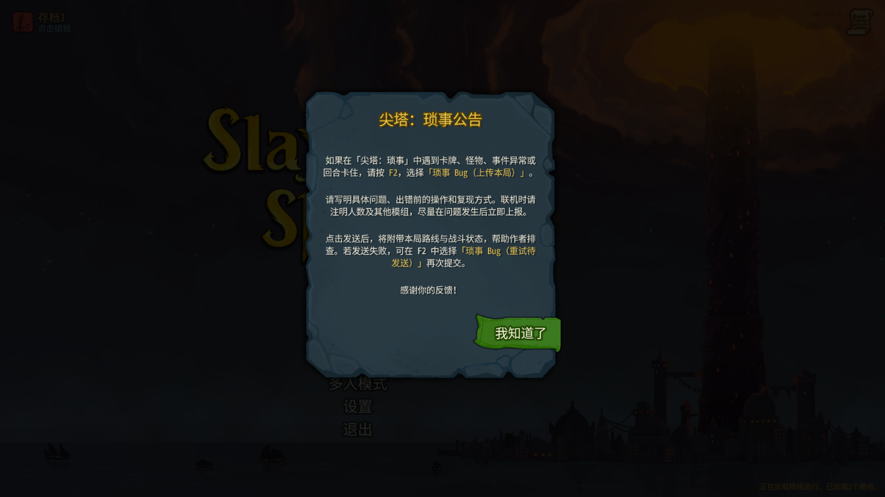

# 尖塔：琐事 1.25.16

统一包支持《杀戮尖塔 2》v0.107.1 和 v0.111.0，无强制前置。本次汇总 1.25.13 之后完成的更新。

## 更新内容

- 新增启动公告，沿用原版石板弹窗、文字和确认按钮。每次启动进入主菜单显示一次，返回主菜单不重复显示；等待其他启动弹窗关闭后再出现。中英文公告介绍 F2 中的「琐事 Bug（上传本局）」分类、问题描述与复现信息，以及发送失败后的重试入口。公告本身不上传数据。
- 深处新增「会咬人的宝箱」：冒险取稀有遗物、付出生命取普通遗物，或捡起金币。风险和代价在选择前展示。
- 深处新增「满员的病房」：在全额治疗与诅咒、局部麻醉与后续两场开场少抽牌，以及少量回复之间选择。配套麻醉记录遗物和非人类病房插画；事件、奖励、抽牌与存档沿用原版流程。
- 「诡谲之店」改为两名原版假商人，事件与战斗都有双商人场景，调整两人的坐垫站位并重写中英文案。战斗准备只调整一次生命值，避免多人共享事件重复减半。
- 「命悬一线」仅允许分裂攻击牌；出现条件、选牌范围和提示同步修改。既有分裂附魔不变。
- 恢复 v107.1 中的商人猜拳功能，补齐对应随机数接口；继续由原生购买流程结算金币、库存与奖励。
- 修正致盲牌抽入手牌时短暂露出原卡面的情况；抽牌动画开始前覆盖视觉，实际费用与层数仍由原生抽牌 Hook 结算。
- 修正地图横路与按钮的坐标随原生节点布局变化而错位的问题，缩放与滚动后仍跟随端点。

## 验证

两个目标实现、统一引导与 BaseLib 可选桥均重新构建，零警告／错误。核对内嵌实现哈希；最终 PCK 保留已验证场景和插画，逐项核对 1308 个资源，本轮仅覆盖两张公告本地化表。

最终包在两版原生加载器中通过启动、涅奥遗物选项与奖励、深处事件池检查。双假商人各 179 项、事件／遗物各 643／607 项、商人购买各 212 项、分裂与致盲抽牌遮罩检查均通过。商人和事件测试含单进程 1–4 玩家模型；不是实际多机联机测试。

使用各版本自己的完整客户端检查中文／英文公告显示与关闭；v107.1 实际保存退出、重建主菜单后没有重复公告，重启进程则重新显示。v111 地图横路 UI 回归通过。既有 CaveGod 综合探针未适配 v107.1 的骨骼 API，不能把其编译失败写成 v107.1 横路 UI 测试通过。

## 上报问题

游戏中按 **F2**，选择 **琐事 Bug（上传本局）**。请写明异常、之前的操作与复现方式；联机时补充人数和其他模组。主动发送时附带本局路线与战斗状态，失败报告保留在本机，可选择 **琐事 Bug（重试待发送）** 重试。

## English

- Added a localized startup notice using the base game's modal, panel and confirmation button. It appears once per launch, waits for other startup dialogs, and explains the Things F2 bug-report category, useful reproduction details and retrying pending reports. The notice itself sends no data.
- Added two Depths events: Biting Chest and Crowded Ward. Choose between rewards, health costs, a curse, or a temporary opening-draw penalty. Includes an Anesthetic Chart relic and new event illustrations.
- Robbery Fake Merchant now features two original fake merchants. Updated their rug positions and dialogue; shared multiplayer preparation halves their health only once.
- Cutting It Close now splits Attack cards only. Updated eligibility, selection and prompts while preserving existing Split enchantments.
- Restored Merchant bargaining on v107.1. Corrected the initial visual reveal of blinded cards and map-crossroad alignment after native layout changes.

Both supported targets passed native startup, event, merchant, card and package checks. The notice was visually reviewed in both full clients. Multiplayer coverage uses native models in one process; real networked multiplayer was not tested.

Install the four files in the ZIP's `STS2_Things` folder into `mods/STS2_Things` after exiting the game. BaseLib and RitsuLib remain optional. The ZIP, SHA256 checksums and these notes are distributed together on GitHub.
