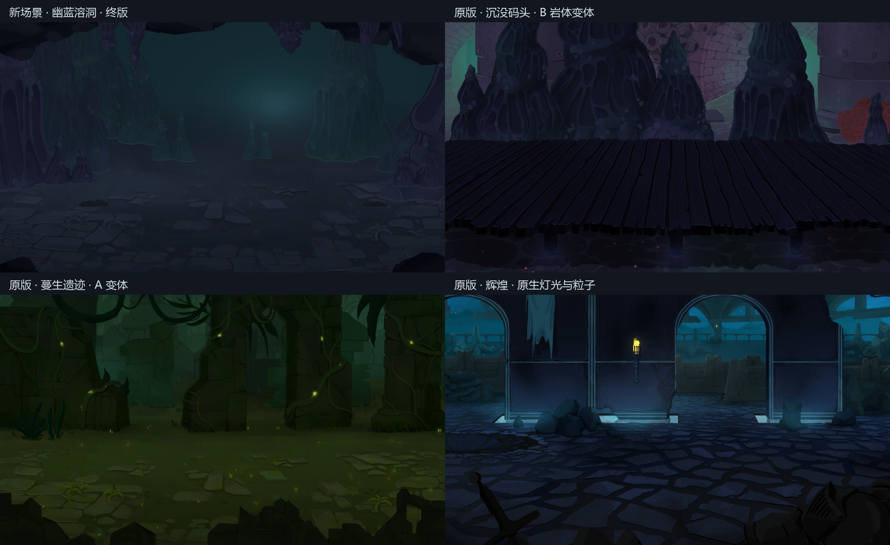
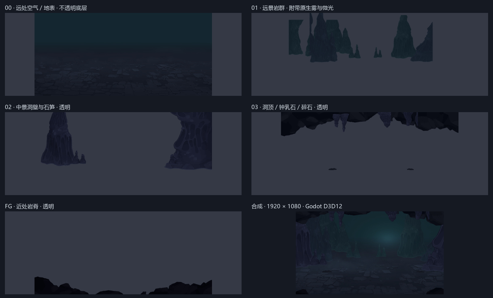

# 幽蓝溶洞 · 交付前画风自审

终版 r04：**自审通过**。审核对象是 Godot 实际渲染后的画面，参考来自同一套 `STS2-V111` 解包资源。审核依据是绘景笔触、色彩明度、构图层次、透明边缘和原版渲染方式；数值用于发现异常，不替代视觉判断。

## 退回重做记录

| 版本 | 观察到的问题 | 处理 |
|---|---|---|
| r01 | 后方石柱过密；两处碎石被矩形边界截断；错误地按普通 alpha 合成原版加色光斑，地面出现水平接缝 | 退回。重新构图，改用四周透明的完整碎石，移除烘焙光斑 |
| r02 | 缩小的整根岩柱露出源图顶端的平切口 | 退回。远处改用完整尖顶石笋，连续大岩柱接入洞顶遮挡 |
| r03 | 实际渲染中间调偏亮；2560 × 1080 的右侧出现岩体边缘；默认导入参数与原版不一致 | 退回。地表转为更暗的蓝紫色，扩大右侧岩体覆盖范围，使用原版 BPTC / straight-alpha 参数重新导入 |
| r04 | 以上问题已消除，三个画幅均复查 | 通过，作为交付版本 |

工作区保留了早期 `review/r01_composition.png`、`r02_composition.png`、`r03_composition.png` 以及 r03 / r04 的引擎截图；交付 ZIP 只收录终版和此记录。

## 终版视觉审核

| 检查项 | 观察与结论 |
|---|---|
| 原版笔触 | 岩体孔洞、岩脊折面、石板裂缝保留原版绘景中的不规则边缘和面色，未引入写实 PBR 纹理或均匀矢量描边。通过 |
| 洞穴主题 | 岩壁、悬垂钟乳石和近处岩脊围合成洞室；远处的小石笋与冷色薄雾给出纵深。通过 |
| 色彩与明暗 | 蓝紫近景、冷青远景、暗色地面保持原版地下场景的低明度关系；微光没有漂白岩体或造成光斑矩形边界。通过 |
| 绘景层次 | 五个独立绘景平面从远到近排列，岩体缩放和明度变化能区分远近。通过 |
| 战斗区域 | 中间地面与角色通常出现的区域保持低细节强度，前景岩脊主要占底边。背景节点在原版角色容器之前。通过 |
| 接缝与透明度 | 普通视口、2560 × 1080 和 1440 × 1080 下逐张检查，没有 r01 的光斑接缝、碎石平切口或 r03 的右侧裁切边。通过 |
| 效果 | 使用原版加色材质和雾图集；雾与微粒缓慢运动，亮度不夺取主体注意力。通过 |

新场景比原版沉没码头的构图更开阔，角色区更安静。它保留原画的形状语言和上色方式，并没有逐像素复刻某张完整原版背景。

## 实际验证证据

- Godot 4.5.1，D3D12，Forward Mobile；使用 NVIDIA RTX 5070 Laptop GPU 完成渲染。
- 四套场景在同一进程、同一渲染设置下截取。原版参照保留其绘景、粒子和材质，只去除与独立预览无关的 C# 游戏服务 / 编辑器钩子。
- 五张贴图均为 2048 × 960 RGBA；第 00 层 alpha 全为 255，其余图层同时包含透明和实心像素。
- BPTC 高质量压缩；无 mipmap；不预乘 alpha；不修补 alpha 边缘。终版截图来自这些已导入贴图。
- 连续相隔 120 帧、固定 60 fps 的截图中，333,288 个像素发生变化，其中 6,201 个像素的通道差超过 2；动态效果已实际运行。
- 整体灰度中位数由 r03 的 40.96 降到 32.39。终版与原版参照的详细灰度与区域梯度诊断在 `review/final/validation.json`。没有把这些统计量当作“画风相似度分数”。
- 场景及资源引用均解析成功，运行时根保留原版 `NCombatBackground.cs`。PCK 包含 21 项新资源，重新挂载后五个真实图层全部加载并实例化成功：`PACK_ROUNDTRIP_PASS`。
- 最终实际渲染日志没有资源或脚本错误。D3D12 的 PSO caching 提示是引擎警告，不影响本次截图或资源加载。
- 本机 Mono 4.5.1 编辑器在导入时记录了 `.NET Sdk not found` 环境错误，但贴图导入完成，随后 GPU 渲染和 PCK 检查成功。为单独核验交付预览工程，另外使用已安装的标准版 Godot 4.6.1 在全新临时目录完成导入验证；不修改本机 SDK 配置，不把 4.6 的导入缓存放入游戏资源包。

验证覆盖独立 Godot 背景渲染、资源结构和打包加载，没有启动实际战斗或替换当前模组已有背景。

## 对照图

