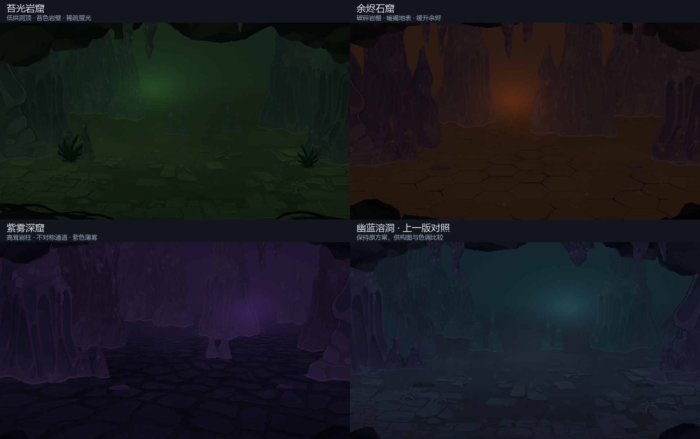

# 洞穴变种画风自审 · r02

三个变种的终版自审结论：**通过**。

继续以 `STS2-V111` 的沉没码头、蔓生场景、蜂巢地表和辉煌地表为原画来源，并以已交付的幽蓝溶洞为分层与渲染基准。检查对象是 Godot 实际渲染帧。

## 修改记录

第一轮原生渲染发现：余烬版远景岩群左侧和紫雾版左侧中景后方存在矩形裁切直边。它们来自原图半根岩柱或被截断的相邻岩群，不能作为洞内独立元素使用。

r01 退回修改。r02 改用横向轮廓完整的连接岩群重新构图，同时更换苔光版的同类风险裁切。修正后重新渲染全部三个变种与三种画幅；第二轮未观察到上述直边、透明漏底或光斑矩形接缝。

## 逐款审查

| 版本 | 构图与画风观察 | 结果 |
|---|---|---|
| 苔光岩窟 | 较低的暗色洞顶围合上缘；左右岩壁之间保留开阔的角色区域。植物使用原版完整叶丛，细节密度集中在两侧；苔绿色、暗岩和萤光保持原版蔓生场景的色彩关系 | 通过 |
| 余烬石窟 | 岩柱重新错开，后方暖光沿通道出现；地面沿用原版蜂巢场景的手绘龟裂形状，配色转为暖褐。微小橙色余烬缓慢上升，没有加入写实火焰或强烈泛光 | 通过 |
| 紫雾深窟 | 大岩柱偏向左侧，右侧形成较窄通道；原版碎石地表与高柱结合，紫色空气层区分前后景。没有露出的裁切直边，描边和孔洞形状仍来自原版绘景 | 通过 |

三版保留的是同一套手绘形状与渲染方式；构图、地表、配色和微粒各有变化。对照图显示三种方案及上一版蓝色方案，未把单一统计量当作画风相似度分数。

## 资源和渲染检查

- 15 张贴图均为 2048 × 960 RGBA；三张第 00 层 alpha 全为 255，其余 12 张包含透明和实心像素。
- 与原版相同的 BPTC 高质量压缩、无 mipmap、straight alpha、不修补 alpha 边缘。
- 1920 × 1080、2560 × 1080、1440 × 1080 均已实际渲染，并检查洞顶、左右边缘与地面。宽窄画幅对照见 `review/final/aspect_review.jpg`。
- 每版还截取相隔 120 帧的第二张图，检查雾和微粒实际运动，详见 `review/final/validation.json`。
- 场景入口保持原版 C# 背景脚本和五个槽位；效果仍使用原版雾图集、光斑、微粒贴图与原生加色材质。
- 最终渲染日志没有资源或脚本错误；D3D12 的 PSO caching 提示是引擎警告。
- 合并 PCK 重新挂载并加载真实图层，结果保存在 `review/final/pack_check.log`。

验证范围为背景素材与独立渲染、资源打包和加载，没有启动实际战斗。

