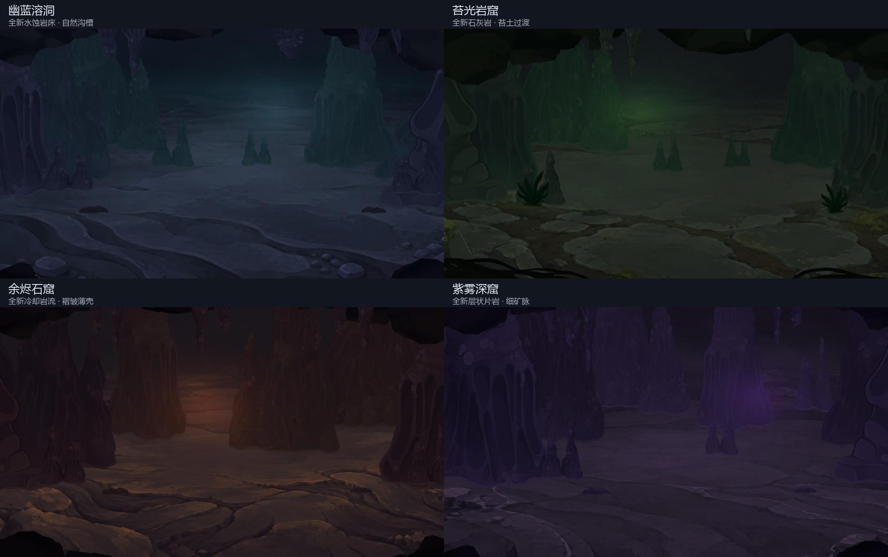
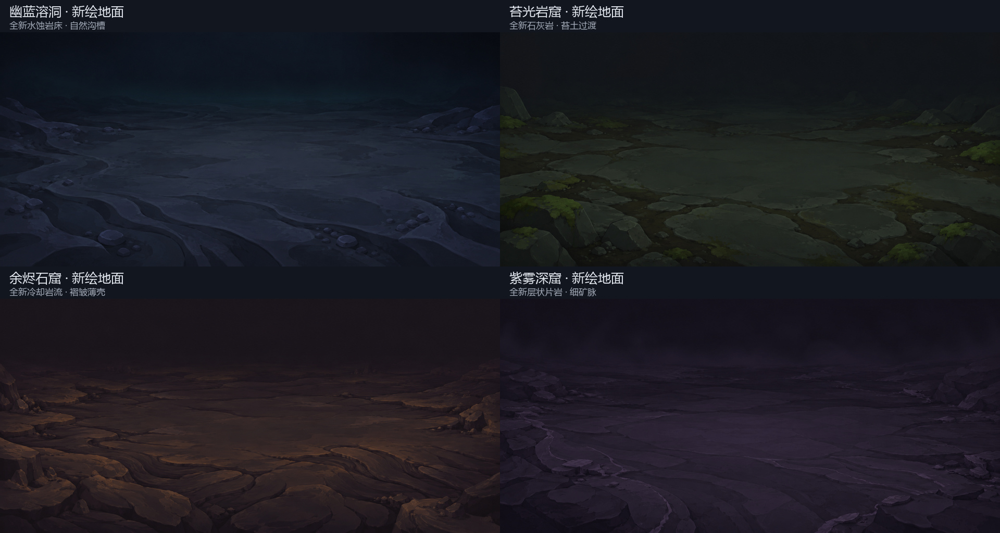

# 全新地面 · 交付前自审

结论：四套全新地面的风格、透视与场景衔接自审通过。本次审核针对新生成地面，不沿用旧地板版本的审核结论。

## 新地面来源

四幅分别通过用户指定的 API 生成，请求模型 `gpt-image-2`，使用技能附带 CLI 的参考图输入。参考只包含去掉第 00 层的洞壁布局和原版岩体画法，未提交原版地板。

首先生成幽蓝版并合成检查，确认手绘色面和透视合适后，再分别生成另外三种新地貌。本轮四幅均在原始输出和原生场景合成两个阶段检查；没有将换色结果算作独立的新绘景。

| 场景 | 新地貌与观察 | 结论 |
|---|---|---|
| 幽蓝溶洞 | 连续水蚀岩床、曲折沟槽和边缘圆砾；中央平缓，蓝灰色面与洞壁相接，没有原有石板拼缝 | 通过 |
| 苔光岩窟 | 石灰岩自然过渡到暗土，苔藓集中在外围；没有复用旧地板的植物、石块布局或砌缝 | 通过 |
| 余烬石窟 | 冷却岩流的褶皱和碎薄壳，中心留出平坦地面；六边形蜂巢格已移除，暖色边缘没有形成高亮熔岩或抢眼泛光 | 通过 |
| 紫雾深窟 | 片岩薄层、细矿脉和稀疏碎片；天然长裂隙替代原有砌石拼接，紫色层次与前后岩柱协调 | 通过 |

笔触检查关注不规则手绘边缘、简化岩石色面、低明度和克制的材质细节；避开照片材质、规则几何格、重复铺贴和强镜面反光。细节主要在边缘与近处，常用角色站位区域保持平整。

## 实渲与资源检查

- Godot 4.5.1 / D3D12 / Forward Mobile 实际渲染四个场景。
- 每套均检查 1920 × 1080、2560 × 1080、1440 × 1080，未观察到透明漏底、矩形光斑接缝、地表贴片边界或露出的背景裁边。
- 四张运行时 `_00.png` 与各自的新绘景源图逐像素一致；构建配方没有继续读取原版的 Overgrowth、Hive、Glory 或 Underdocks 地板。
- 所有新地面为 2048 × 960 RGBA，第 00 层 alpha 全为 255，使用原版 BPTC 导入参数。
- 合成后检查岩壁脚部与新地面的颜色衔接、地面透视、前景岩脊的遮挡和站位区域留白。
- 相隔 120 帧的截图确认雾与微粒仍在运动，详细结果见 `review/final/validation.json`。
- PCK 的 84 项资源重新挂载，20 个实际图层加载并实例化成功，记录见 `review/final/pack_check.log`。
- 最终渲染无资源或脚本错误；D3D12 的 PSO caching 提示属于引擎警告。

生成服务未返回精确的请求像素尺寸，已保留原始图并仅做 RGBA / 尺寸标准化。原始尺寸、请求参数和源图哈希均记录在 `generation_provenance.json`，未将尺寸标准化描述为重新绘制。

本次验证覆盖素材、实际背景渲染与打包加载；尚未将它们接入真实战斗。洞壁和前景沿用之前的分层资产，本次全新生成的是四套地面及其远处空气过渡。

